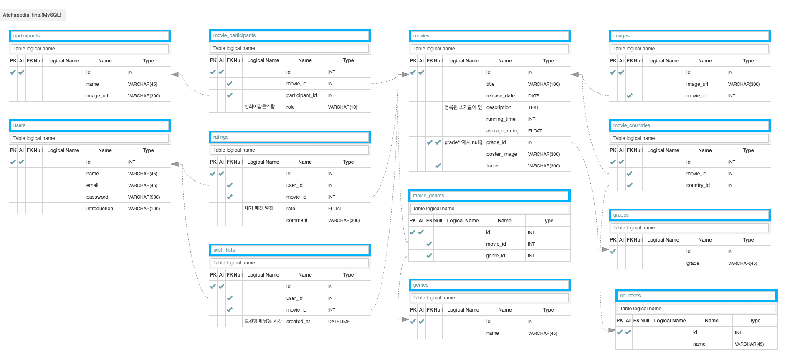

## 구현 기능

- CommentView : 영화 리뷰 등록 및 List comprehension을 활용한 리뷰 조회기능 구현
- MovieView : Q객체, order_by, distinct, offset, limit을 활용한 영화리스트 조회 기능 구현
- Loginview, Login_decorator : 로그인 로직 구현 및 jwt 통한 인증/인가
- RateView : 사용자의 영화 평점 업데이트 및 영화 평균 평점 aggregate을 통해 반환
- GenreMovieView : 영화와 관련된 장르의 영화 필터링하여 반환, 쿼리 최적화 진행
- MyPageView : 마이페이지 구현(데코레이터로 사용자 확인), select_related 통한 쿼리 최적화

## EndPoint

[post] SignUpView : /users/signup  

[post] Login : /users/login  

[post] RateView : /moives/<int:movie_id>/user-rate  

[post] CommentView : /moives/<int:movie_id>/comments  

[get] RateView : /moives/<int:movie_id>/user-rate  

[get] CommentView : /moives/<int:movie_id>/comments  

[get] MyPageView : /users/mypage  

[get] MovieView : /moives  

[get] MovieView : /movies?country=한국  

[get] MovieView : /movies?country=외국  

[get] MovieView : /movies?genre1=&genre2=  

[get] MovieView : /movies?rating=0  

[get] GenreMovieView : /moives/related-movies?id=2  

[get] MovieDetailView : /moives/<int:movie_id>  

## Modeling

